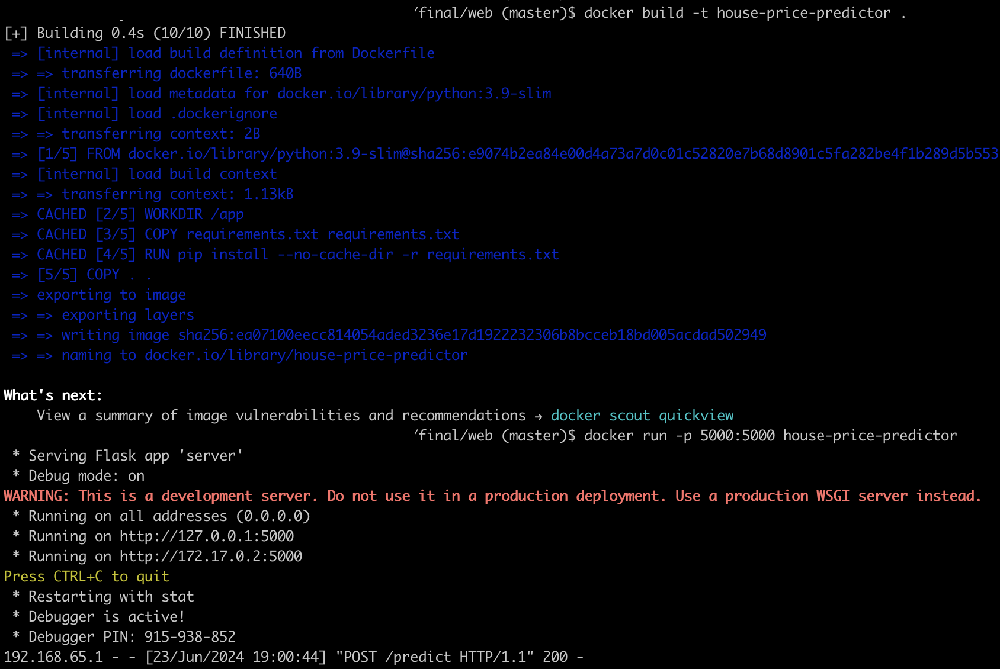
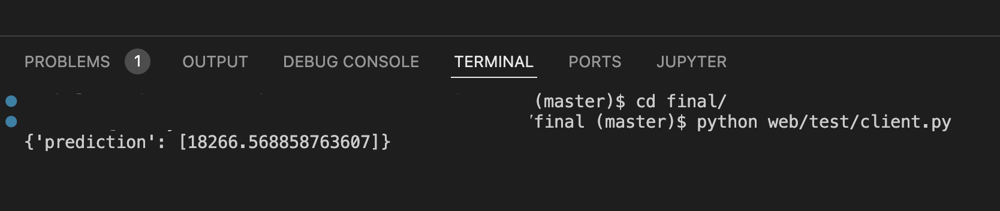

# Инструкция по запуску веб-приложения

### 1. Скачайте репозиторий с GitHub

```
git clone git@github.com:moskalen/sf_data_science.git
cd sf_data_science
pip install -r requirements.txt
```

### 2. Скачайте обученную модель предсказания

Модель [можно скачать здесь](https://drive.google.com/file/d/18u-vDZ8bcpsP1PzDH2Sknm3kKjrebzJM/view?usp=sharing) и скопировать в папку `web/app/models/`.

### 3. Соберите Docker-образ:

```
cd final/web
docker build -t house-price-predictor .
```

### 4. Запустите контейнер:

```
docker run -p 5000:5000 house-price-predictor
```




### 5. Проверьте работу сервиса:

Запустите тестовый клиент, чтобы проверить, работает ли API. В новом терминале выполните следующую команду:

```
python web/test/client.py
```


