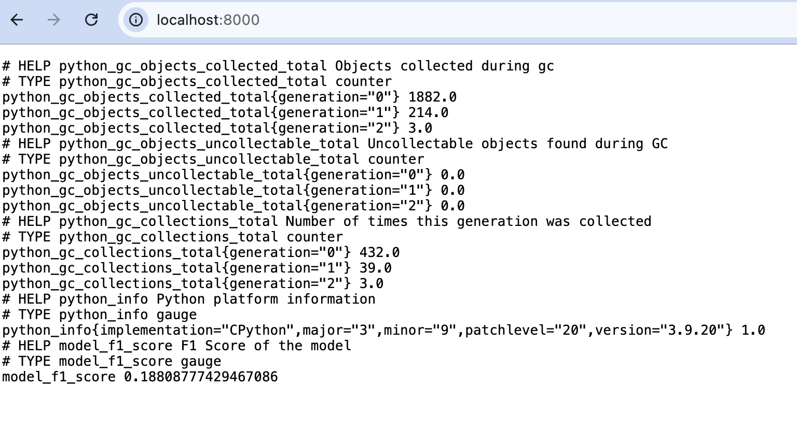
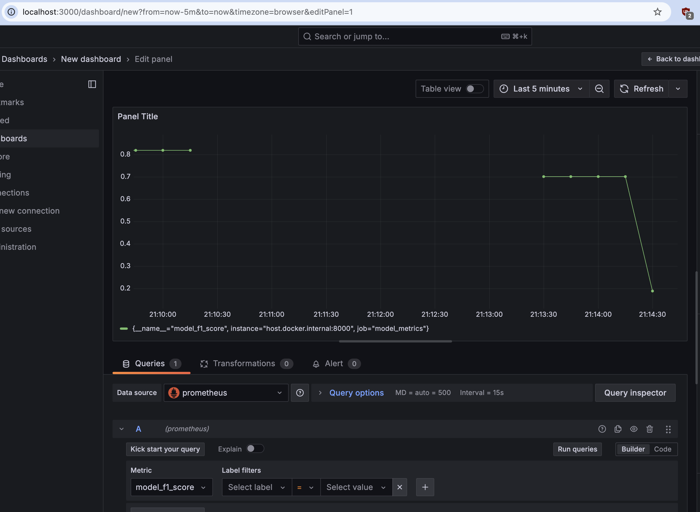

# Домашнее задание: Модель для показа рекламных предложений

В этом проекте необходимо реализовать мониторинг модели с помощью Prometheus и Grafana

## Инструкция для проверки проекта
1. Загрузите ноутбук [`main.ipynb`](main.ipynb)

2. Загрузите [архив с данными](winequality-red.zip) и скопируйте его в ту же папку, что и `main.ipynb` ноутбук под именем `winequality-red.zip`.

   ***Раскрывать архив не надо***

3. Загрузите [`requirements.txt`](requirements.txt)

4. Запустите Prometheus & Graphana
   ```
   docker network create monitoring_network
   docker run -d --network=monitoring_network -p 9090:9090 -v ./prometheus.yml:/etc/prometheus/prometheus.yml --name prometheus prom/prometheus
   docker run -d --network=monitoring_network --name=grafana -p 3000:3000 grafana/grafana-enterprise
   ```

5. Установите в Graphana (`Home -> Connections -> Data Soource`) новый источник данных Prometheus
   ```
   http://prometeus:9090
   ```

6. Запустите ноутбук [`main.ipynb`](main.ipynb)

7. Убедитесь в работоспособности экспортера метрик:

   

8. Создайте панель с новой метрикой `model_f1_score`:

   

